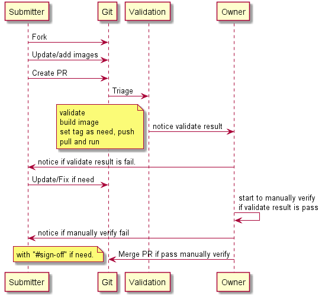

# Web App for Containers quick start docker images

This repo contains all currently quick start docker images contributed by the community.

## Contribution guide

Please follow the guidelines to be compliant . If any docker image is out of compliance , it will be **blacklisted** from this repo and eventually removed.

## Files, folders and naming conventions

- Create a new folder for a new docker image and include a version folder.
  - If you are updating an existing image  , create a new version folder within your image folder.

Example:

``` yaml
+my-image
  \  0.1 
        \Dockerfile and other files 
```

- Must include a README.md within version folder to describe:
  - Any changes with deployment of use of the image
  - Include comments if the image is not backward compatible and how user can manually upgrade to new version

- [**Submission Work Flow**](/contribution-guide/submissionvalidation.md). The sequence diagram of submission validation work flow.

- [**Best practices**](/contribution-guide/best-practices.md). Best practices for improving the quality of your docker image

- [**Git tutorial**](/contribution-guide/git-tutorial.md). Step by step to get you started with Git.

- [**Useful Tools**](/contribution-guide/useful-tools.md). Useful resources and tools for docker image development

## Submission workflow

The submission process as shown below:

1. Fork the github repository
1. Checkout branch build-test
1. pull changes from build-test branch
1. create a new branch or use build-test branch
1. Commit your changes to the forked repository
1. Push changes to forked repository
1. Send a PR ONLY to build-test branch of main repository
1. Automated Travis CI will run to validate the PR
1. If build fails , fix the issues and commit changes to the same PR
1. if build passes  the reviewers for the PR will manual verify and provide guidance
1. PR is merged to build-test branch in main repo by repo reviewers
1. Repo reviewers (Owner) will run sanity test on web app for containers
1. If the image has no issues it will be merged into master
1. Image will be deployed to Docker hub

The time taken to approve or reject a PR can vary as this is community driven.

**Please submit PR to build-test branch ONLY . Any PR directly submitted to master from a contributor will be rejected.**


- Owner  : The team of members who maintain this repository and review, merge pull requests contributed to the repo.
- Submitter : Contributor member of one or more docker images on this repository

### Guidance on setting tags during *Automated Deployment to Docker hub* step

The related image would be deployed to Docker hub automatically as soon as commit message include string "#sign-off".

Below 2 kinds of tags would be set.

- Set tag as the value of version folder name. For example:

```yaml
Update files which under ..\my-image\0.1, 
it would push my-image:0.1 to Docker hub.
```

- Set tag as "latest".
  - There is 1 file names latest.txt exist under image folder.
  - The value of above file is as same as the related image version.

For example:

```yaml
Update files which under ..\my-image\0.1, 
..\my-image\latest.txt is exist and the content is "0.1", 
it would also push my-image:latest to Docker hub.
```

## Deploying Samples

You can deploy these samples directly through the Azure Portal

1. Go to [Azure portal](https://portal.azure.com)
1. Search for [Web app for Containers](https://portal.azure.com#create/microsoft.appsvclinux)
1. Enter web app name , subscription , resource group
1. Select configure container and enter the docker hub image name with the tag name. you can find all the docker hub images [here](https://hub.docker.com/r/appsvcorg)
1. Review the readme.md for the image you are using to make sure any additional configuration such as app settings need to be updated. Make the necessary changes
1. Now browse the application

*Note: The first request can take longer to complete since the docker image needs to be pulled and run on the container for the first request. This can occur when you scale up your application or the instance gets recycled.*
