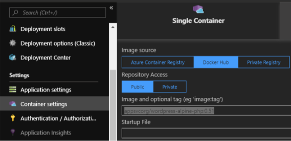
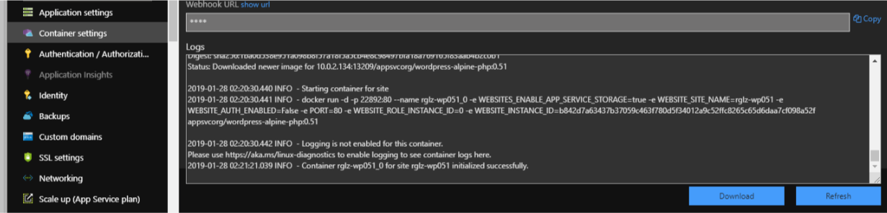

# Wordpress 0.61/0.72 is released!
- If you are still using the version earier than 0.61, we strongly suggest to have an upgrade!

## Change Log:
- **Version 0.72** ( [Readme](../wordpress-alpine-php/0.72/README.md) )
  1. Upgrade php-fpm to 7.2.13.
  2. Add function log rotate. (It's disabled if deploy to web app of azure by default.)
  3. Php-fpm and nginx are watched by supervisord. 
  4. Allow user to modify nginx config files.

- **Version 0.61** ( [Readme](../wordpress-alpine-php/0.61/README.md) )
  1. Change to Nignx+fpm, improve performance.
  2. Update version of php to 7.2.8.   

## Choose the version:
- Question: Did you made any changes of apache config files? such as .htaccess ?
- If above answer is yes, you need to upgrade to ```appsvcorg/wordpress-alpine-php:0.72```.
- If above answer is no, you can choose one of them.

## How to:
- Back up /home/site/wwwroot folder by FTP/tar, etc...
- Back up Database by any tool as your wish.
- Technically, upgrade process should keep your data. Whatever, let's backup just in case.
- Modify container settings to ```appsvcorg/wordpress-alpine-php:0.61``` or ```appsvcorg/wordpress-alpine-php:0.72```, just like below pic, Save.

- Restart web app, technically this web site should be restarted automatically after save changes of container settings. You also can manually stop/start it as your wish.
- Wait, and keep watching of logs in Container settings, Refresh, until you see ```Container [...] for site [...] initialized successfully.```, just like below pic. 

- Browse, you will see your original site. You site is upgraded successfully!

## My Site doesn't show normally after upgrade !!!
- Condition 1, upgrade process is broken unexpected.
    - KUDU/SSH, repeat ```rm -rf /home/site/wwwroot``` until it's really removed, Restart web site.
    - Restore /home/site/wwwroot form your backup, restart web site again.

- Condition 2, you have made some changes of apache config files and upgrade to 0.72 this time.
    - KUDU/SSH, go to /home/etc/nginx, update nginx config files as your wish.
    - run cmd ```/usr/sbin/nginx -s reload```.
    